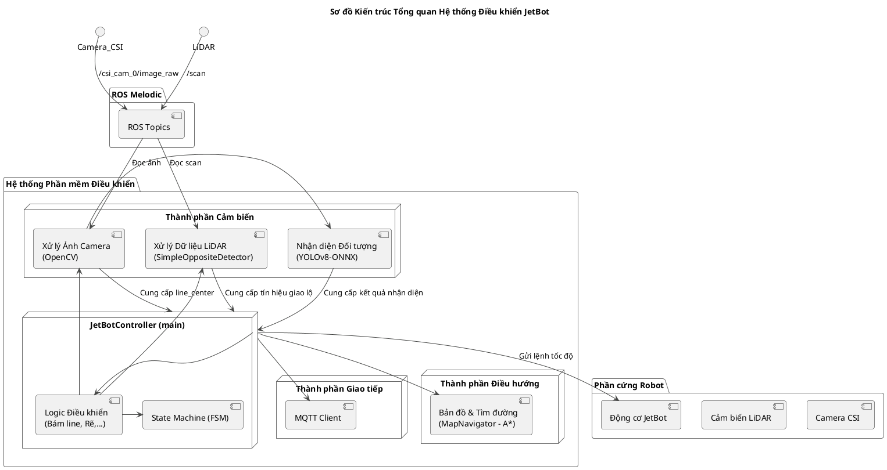
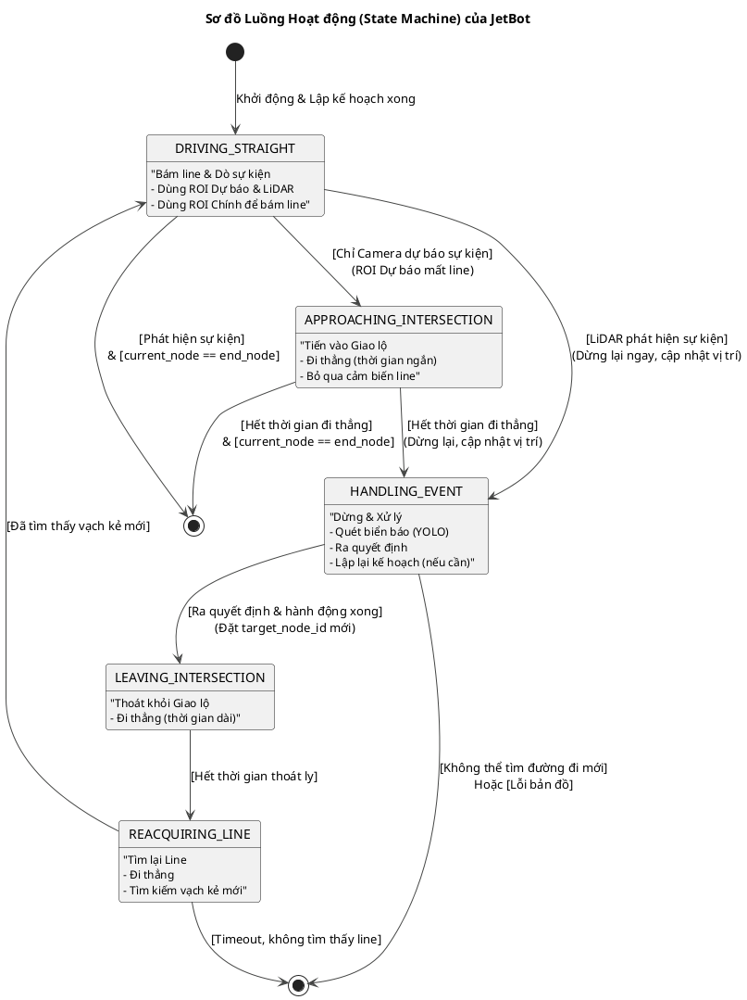

1.  **Sơ đồ Kiến trúc Tổng quan:** Mô tả các thành phần chính của hệ thống và mối quan hệ giữa chúng.
2.  **Sơ đồ Luồng Hoạt động (State Machine):** Mô tả chi tiết các trạng thái và các sự kiện/hành động gây ra sự chuyển đổi giữa chúng.

---

### 1. Sơ đồ Kiến trúc Tổng quan Hệ thống

Sơ đồ này cho thấy các "khối xây dựng" chính và cách chúng tương tác với nhau.

**Giải thích Sơ đồ Kiến trúc:**

*   **ROS Melodic** là nền tảng giao tiếp, truyền dữ liệu từ **Phần cứng Robot** (Camera, LiDAR) đến **Hệ thống Phần mềm Điều khiển** thông qua các `Topics`.
*   **Hệ thống Phần mềm Điều khiển** là phần code chính của bạn, được chia thành các khối logic:
    *   **JetBotController (main):** Là "nhạc trưởng", chứa `State Machine` để quyết định hành vi chung và `Logic Điều khiển` để thực thi các hành động cụ thể.
    *   **Thành phần Cảm biến:** Các khối chuyên xử lý dữ liệu thô từ cảm biến (OpenCV xử lý ảnh, `SimpleOppositeDetector` xử lý LiDAR) và AI (`YOLO`).
    *   **Thành phần Điều hướng:** `MapNavigator` độc lập, chịu trách nhiệm về bản đồ và tìm đường.
    *   **Thành phần Giao tiếp:** `MQTT Client` để gửi dữ liệu ra ngoài.
*   Luồng dữ liệu rất rõ ràng: Cảm biến -> Topics -> Bộ xử lý cảm biến -> Controller -> Động cơ.

---

### 2. Sơ đồ Luồng Hoạt động (State Machine Diagram)

Sơ đồ này mô tả chi tiết các trạng thái và các sự kiện gây ra sự chuyển đổi trạng thái, đây chính là "linh hồn" của hệ thống.

**Giải thích Sơ đồ Luồng Hoạt động:**

*   **Các `state`** đại diện cho các trạng thái trong `RobotState` Enum của bạn.
*   **Các mũi tên** biểu thị sự chuyển đổi trạng thái.
*   **Văn bản trong `[...]`** là các **sự kiện (events)** hoặc **điều kiện (conditions)** kích hoạt sự chuyển đổi đó.
*   **Văn bản trong `(...)`** là các **hành động (actions)** được thực hiện ngay sau khi vào trạng thái mới hoặc ngay trước khi rời đi.

Sơ đồ này thể hiện rất rõ ràng chu trình hoạt động của robot:
1.  Bắt đầu ở `DRIVING_STRAIGHT`.
2.  Khi gặp giao lộ, nó có thể đi qua `APPROACHING_INTERSECTION` (nếu do camera) hoặc nhảy thẳng đến `HANDLING_EVENT` (nếu do LiDAR).
3.  Sau khi xử lý xong, nó đi qua một chuỗi ổn định `LEAVING_INTERSECTION` -> `REACQUIRING_LINE` để đảm bảo nó không bị lỗi.
4.  Cuối cùng, nó quay trở lại `DRIVING_STRAIGHT` để bắt đầu một chu kỳ mới.
5.  Các trạng thái kết thúc `GOAL_REACHED` và `DEAD_END` có thể được kích hoạt từ nhiều điểm khác nhau trong luồng, thể hiện các điểm thoát của hệ thống.